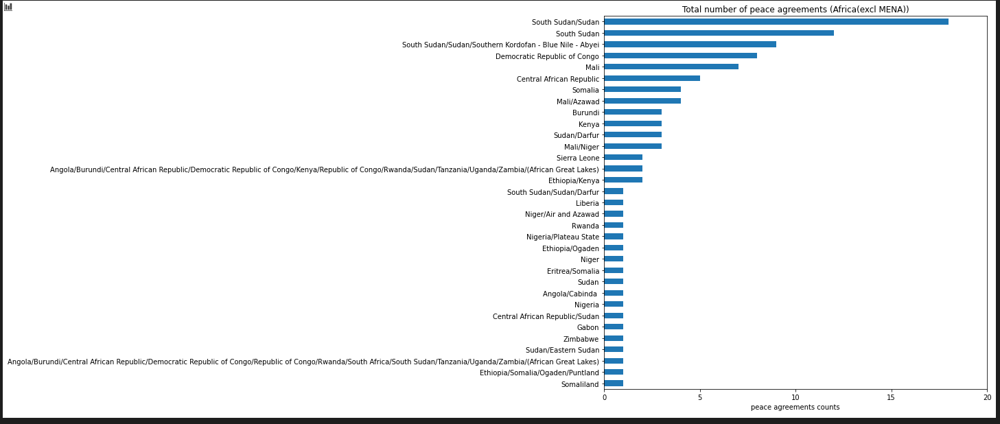

# Assignment 3 

My part of the assignment 3 is to analyze the connection between border issues and natural resource issues according to the "peace agreement.xlsx" by histogram.

## Step 1 

Our motion is to find out the connection between border and natural resource, so the first step is that to filter out the peace agreements in our dataset refer to conflicts over natural resources.

In the dataset, the variable 'NatRes' takes the value of 1 if the peace agreement includes any mention of natural resources. So we choose 'NatRes'=1 as the condition to select natural resource related rows.

The specific steps shown as follow:

* Filter the natural resource related agreements out.
* Show it by country with peace agreement counts.

The result is shown as follow:

## Step 2 Africa(excl MENA)

From the picture above, we can see that lots of country is in Africa area. With the analysis from assignment 2, we can reduce the area to Africa(excl MENA) that is the most worthwhile area to analyze. So we do the steps as follows:

* Reduce the analysis area to Africa(excl MENA)

* Use the above method to analyze the natural resource related agreements in the new area and draw it.

The result is shown as follow:

(Just the area of Africa(excl MENA))

## Step 3

Because of the max proportion of peace agreements in Africa(excl MENA), maybe we can contrast the difference between origin data and natural resource related data.

Then we count the peace agreements in Africa(excl MENA), in the condition of natural resource related or not.

Sort the data of Africa(excl MENA) and the origin by index, By doing this, it is convenient for us to draw pictures.

The result is shown as follow:

## Step 4

explore the connection between border and natural resources.

According to the "PA-X", The variable of 'StBor' and 'StXbor' maybe can present border-related. 

Filter the border & natural resource related peace agreements by country, and sort it by index as same to above origin data. 

Draw the picture to show the difference between border related or not with natural resource related data. But the country which only have 1 or 2 peace agreements maybe have no reference which will be 100% or not. So we choose the top 10 country to analyze, because the number of peace agreements in that is over than 2 with diversity. So we draw the picture like the below.

